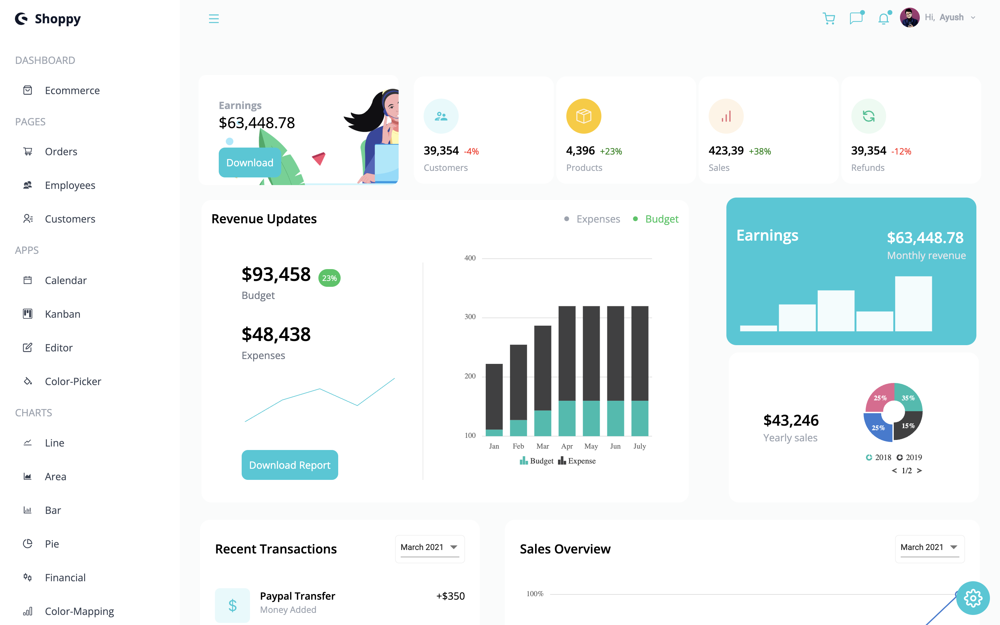
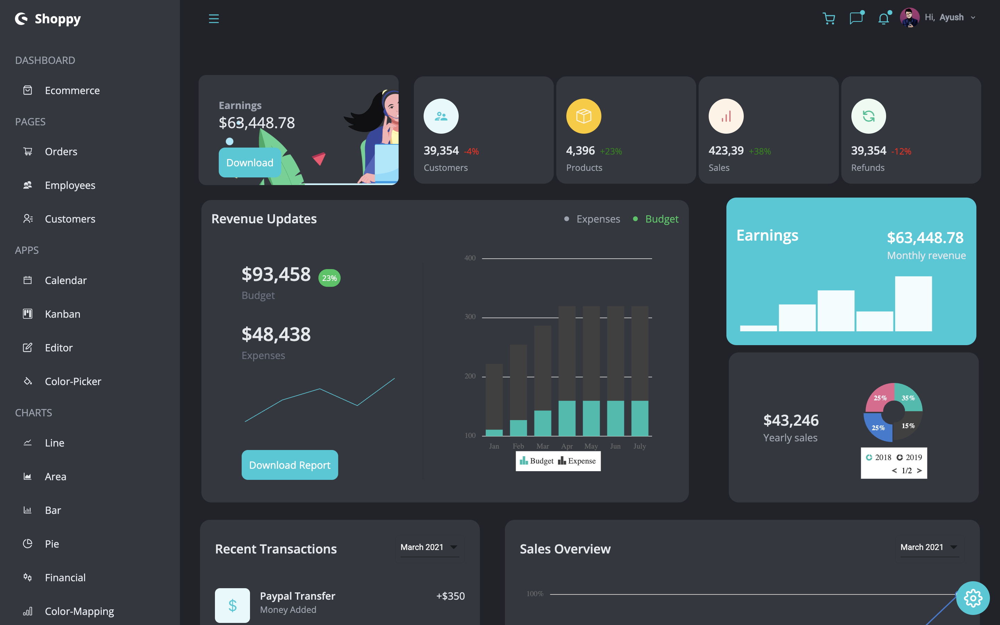
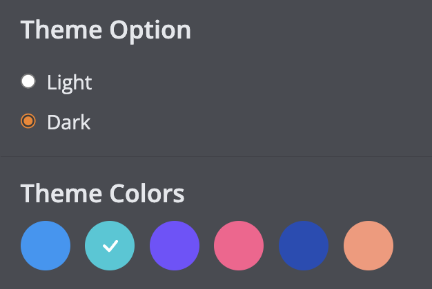

# AdminEdge 📊

### [Demo](https://admin-edge.vercel.app) | [Video](https://youtu.be/TSOPW58Zfa0)

</img>

</img>

AdminEdge is a feature-rich and fully customizable admin dashboard built with `React.js`, `Tailwind CSS`, and `Syncfusion` components. It provides a seamless user experience with mobile responsiveness and a variety of customization options.

## Features ⭐️

- **Responsive Design**: AdminEdge is designed to be fully responsive, ensuring a smooth experience on various devices and screen sizes.
- **Theme Options**: Choose from six different theme colors and toggle between light and dark theme modes according to your preference.

<div align='center'></div>

- **Dashboard**: A comprehensive dashboard providing an overview of key metrics and data visualizations.
- **Pages**:    
    >**Pagination**: Easily navigate through content with built-in pagination.
    
    >**Search and Filtering**: Effortlessly search and filter content for quick access.
    
    >**Editing and Deleting**: Edit and delete content with ease, enhancing data management capabilities.

- **Apps**:
    >**Calendar**: Manage your schedule efficiently with a fully functional calendar.
    
    >**Kanban Board**: Organize tasks and projects using a dynamic and customizable Kanban board.
    
    >**Editor**: Create and edit content seamlessly with a rich text editor.
    
    >**Color Picker**: Choose and apply colors effortlessly with an intuitive color picker.


## Getting Started 🚀
1. Clone the repository:

    ```bash
    git clone https://github.com/your-username/AdminEdge.git
    ```
2. Navigate to the project directory:

    ```bash
    cd AdminEdge
    ```
3. Install dependencies:

    ```bash
    npm install
    ```

4. Start the development server:

    ```bash
    npm start
    ```

5. Open your browser and visit http://localhost:3000 to view AdminEdge.

## Technologies Used 🚀


